<h1>Oppimia asioita</h1>
<h2>Autolayout</h2>

Oivalsin, että hyvin rakennetut auto layout -rakenteet tekevät komponenttien muokkaamisesta huomattavasti joustavampaa ja säästävät paljon aikaa myöhemmässä vaiheessa. Samalla sain paremman käsityksen siitä, miten käyttöliittymä ja sen elementit kannattaa pilkkoa loogisiin osiin, jotka on mahdollista toteuttaa myös koodipuolella selkeinä komponentteina.

<strong>Kuva: Tässä esimerkkiä autolayout.</strong>

Harjoittelin Figma Auto layoutin käyttöä rakenteen hallintaan. Rakensin komponentin jakamalla sen ensin kahteen pääosaan: Header ja ChatScreen. Näiden välissä käytin aiemmin tiimi-kaverin tekemää linebreak-elementtiä.
Headerin sisälle rakensin omat ryhmät, esimerkiksi hakukentän ja nappien osiot, jotta ne pysyvät järjestyksessä ja skaalautuvat oikein. ChatScreen puolestaan jaettiin kahteen kokonaisuuteen: käyttäjien listaan ja ryhmächat-listaan. Molempien sisällä on omat otsikot sekä toistuvat elemen-tit, kuten käyttäjäkortit.

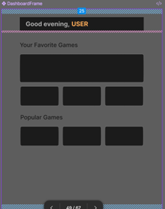
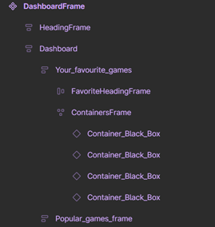

<strong>Kuva: Tässä dashboardframe, jossa käytin autolayouttia. Näin sain aseteltua palasia oikealle paikoilleen.</strong>

<h2>Chat ruudun suunnittelu</h2>

<strong>Kuva: Wireframe mallinnus</strong>

Lähdin toteuttamaan figmassa chat ruutua. Hain tähän ideaa dribbble.com sivuston kautta. Halusin sen olla mahdollisimman yksin kertainen ja selkeästi rakennettu.

<strong>Kuva: Chat mallinnus 2.0 (Figma)</strong>

Tässä olin tuonut mallinnukseen ilmettä palvelumme teemaan sopivilla väreillä, jotta saadaan siihen ilmettä

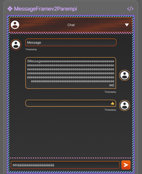
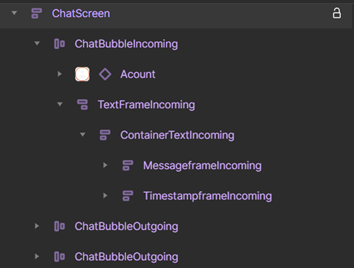

<strong>Kuva: Mallinnusta autolayoutin kanssa, saadaakseen selkeän "hierarkian"</strong>

Kokonaisuus on jaettu headeriin ja chatscreeniin. Chatscreen sisältää viestikuplat (incoming ja outgoing), joissa jokainen kupla on rakennettu erillisistä osista, kuten käyttäjä-ikonista, tekstistä ja aikaleimasta. Näin Auto layout pitää rakenteen selkeänä ja joustavana

<h2>Mallinnuksien kääntäminen angularin puolelle (frontend)</h2>

<strong>Ylempänä kuvat figma suunnitelmista, joita lähdin kääntämään sitten HTML + CSS.</strong>

<strong>Kuvat ”valmiista” koodista. Napit ei vielä olen oikean mallisia, kun ne tulevat sitten "yhteisestä” button-komponentista.</strong>

<strong>Kuva lopullisesta html koodista</strong>

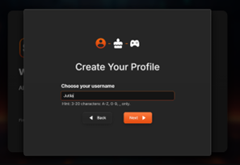
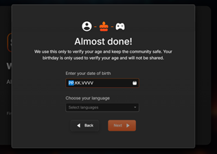
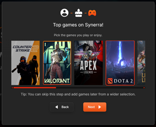

<strong>Kuvat: Lopullisesta näkymästä</strong>

Modali-ikkunoiden jälkeen lähdin rakentamaan "Create profile" pääsivustoa. Lähdin toteuttamaan tätä toisen ryhmäläiseni aiemmin luomansa "Login" sivuston mukaan.

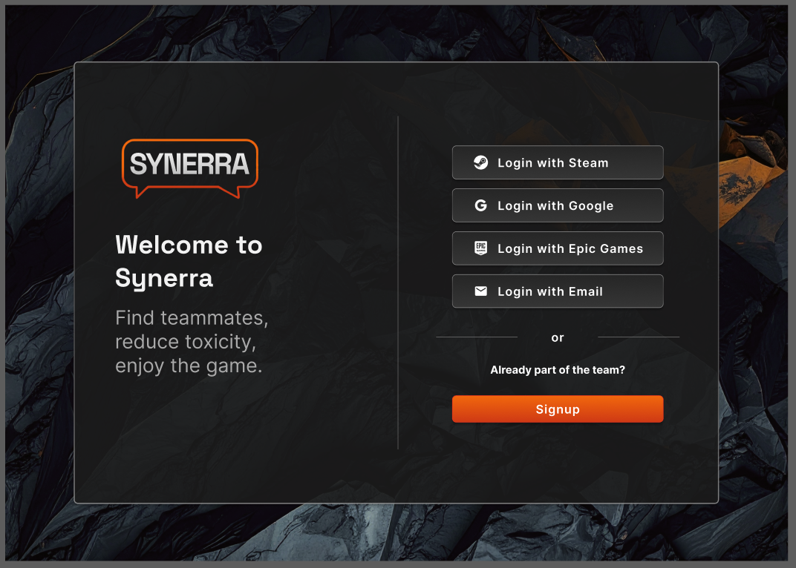

<strong>Kuva: Login näkymä</strong>

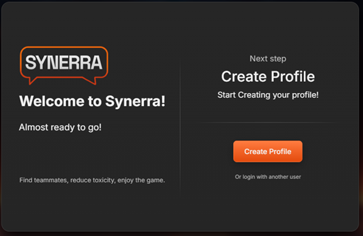
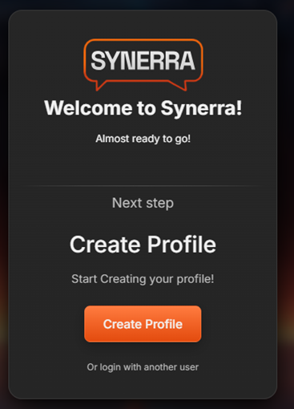

Pienemmällä näyttökoolla vaihtuu järjestys!
Alla css säädöt!

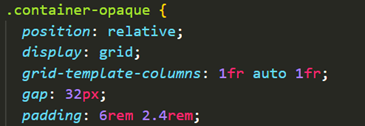
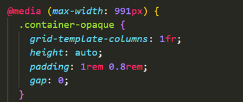

<h2>Validointeja: sing up sivustolle ja profiilin luonnissa</h2>

Tein signup-, login-email-sivustoille ja create-profile modaaleihin validointeja. Harjoittelin erilaisia validointimalleja ( https://dribbble.com/shots/20340740-Sign-up-Forms-Users-need-to-know-password-requirements ) ja niiden näyttämistä käyttöliittymässä (esim. virheilmoitukset ja varoitukset). 

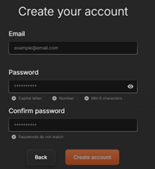
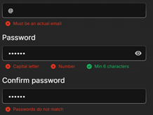
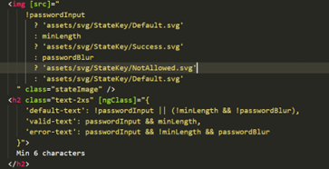

<strong>Kuva: Esimerkki yhdestä status tekstistä</strong>

Rakensin lisäksi funktion, joka tarkistaa sähköpostin virhetilat (esim. sisältääkö ison kirjaimen, numeron ja vähintään kuusi merkkiä) sekä sen, että sähköpostikentät vastaavat toisiaan, jolloin Submit-painike aktivoituu vain validissa tilassa. (eli formValid on true tilassa, jolloin voidaan jatkaa)

