

  <h2>Projektin tausta</h2>
  

    Projektin tavoitteena oli suunnitella ja toteuttaa selainpohjainen palvelu (Synerra), joka helpottaa kilpailullisten videopelien pelaajia löytämään sopivaa peliseuraa. Palvelun ydinidea on tarjota käyttäjille mahdollisuus etsiä pelikavereita erilaisten filttereiden perusteella sekä mahdollistaa syvempi tutustuminen reaaliaikaisen chatin avulla.
  

<h2>Oppimiani asioita TC:n aikana</h2>

Ymmärsin, että hyvin rakennetut Auto Layout -rakenteet tekevät komponenttien muokkaamisesta huomattavasti joustavampaa ja säästävät aikaa myöhemmässä vaiheessa. Samalla sain paremman käsityksen siitä, miten käyttöliittymä kannattaa pilkkoa loogisiin osiin.

 

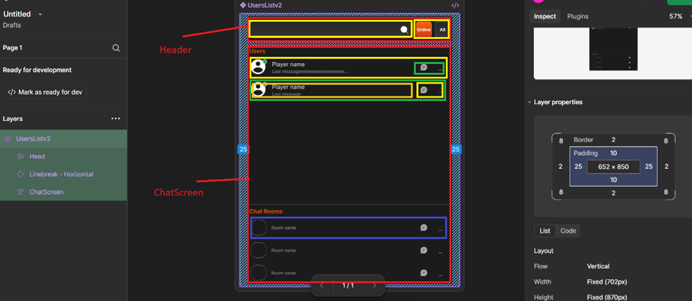
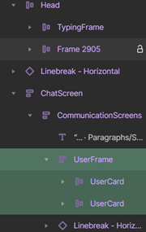

<strong>Kuva: Esimerkki Auto Layout -rakenteesta Figma-työkalussa.</strong>

Rakensin komponentin jakamalla sen kahteen pääosaan: Header ja ChatScreen. Header sisältää hakukentän ja nappien ryhmät, kun taas ChatScreen on jaettu käyttäjälistaan ja ryhmächat-listaan. Näin rakenteet pysyvät selkeinä ja skaalautuvina.

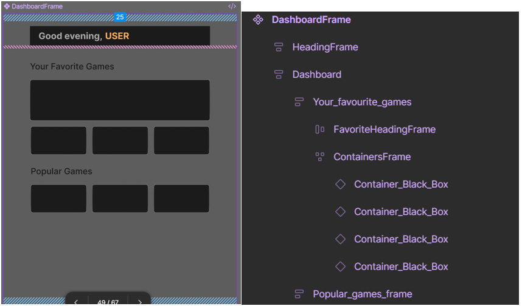

<strong>Kuva: Dashboard-näkymä, jossa Auto Layout helpottaa elementtien asemointia.</strong>

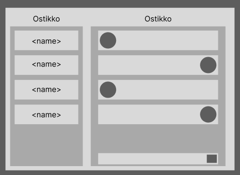

<strong>Kuva: Wireframe-vaiheen suunnitelma</strong>

Lähdin suunnittelemaan chat-näkymää Figma-työkalussa. Hain inspiraatiota Dribbble-sivustolta ja tavoitteenani oli luoda mahdollisimman selkeä ja yksinkertainen käyttöliittymä.

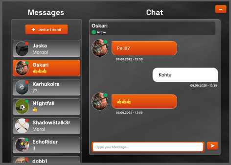

<strong>Kuva: Chat-näkymän jatkokehitetty versio teemaväreillä</strong>

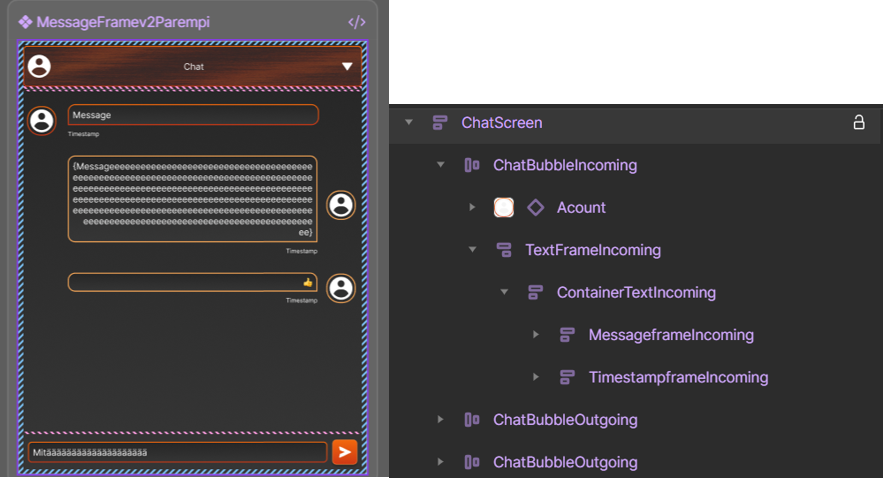

Chatscreen on jaettu headeriin ja viestialueeseen. Viestikuplat on rakennettu Auto Layoutilla erillisistä osista (ikoni, teksti, aikaleima), mikä luo selkeän hierarkian ja joustavan rakenteen.

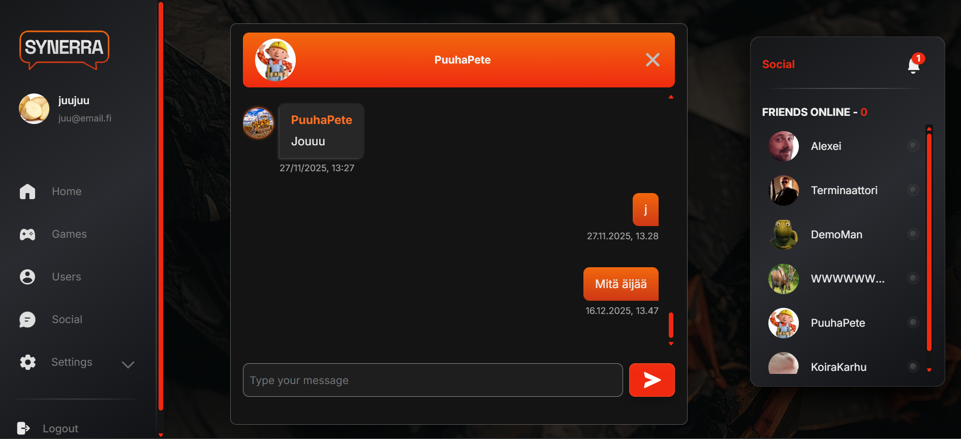

<strong>Kuva: Lopullinen chat näkymä</strong>

Chat ruudun toteutti toinen ryhmäläinen, itselle jäi silloin pientä säätöä esim. pitkien nimien kanssa ja tyylittelyt yms.

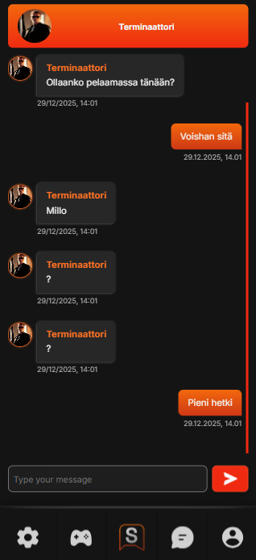

<!-- 
<strong>Kuva: Chat ruutu puhelimella</strong>
 -->

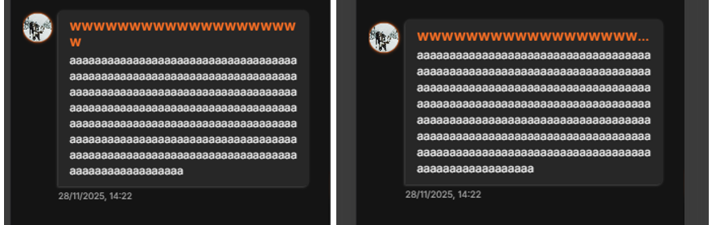

<strong>Tässä kuva pitkän nimen muokkaamisesta</strong>

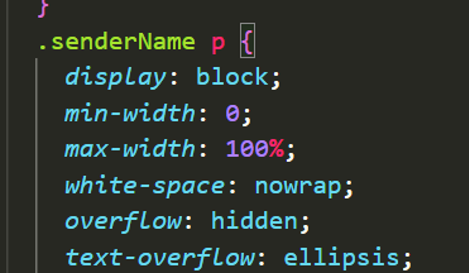

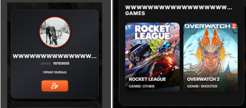

<h4>
Figma-mallinnusten kääntö HTML + CSS
</h4>

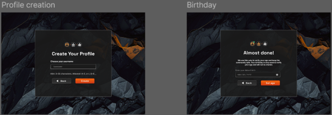

<strong>Kuva: Figma-suunnitelmat ennen koodivaihetta</strong>

 

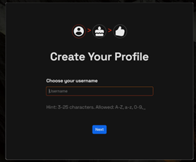

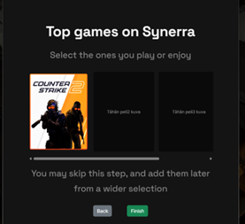

Napit (buttonit) eivät vielä vastaa lopullista ulkoasua, koska ne tulivat myöhemmin yhteisestä button-komponentista.

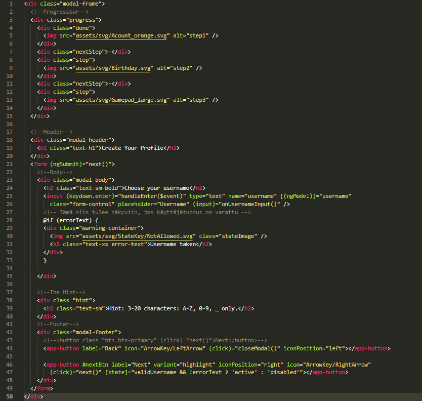

<strong>Kuva: HTML-toteutus “Choose your username” -modaalista</strong>

 

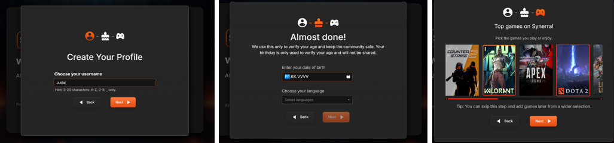

<h4>
Toteutin validointeja signup-, login- ja create-profile-näkymiin. Harjoittelin erilaisten virhe- ja tilaviestien näyttämistä käyttöliittymässä.
</h4>

  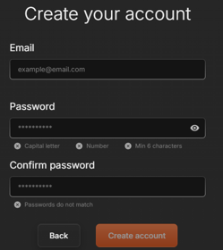
  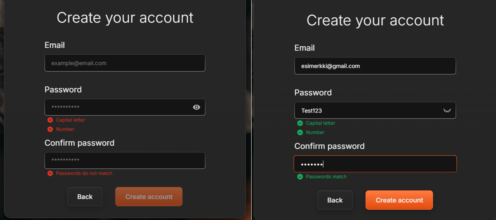

  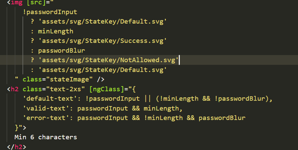

<strong>Kuva: Esimerkki validointien status-teksteistä</strong>

Rakensin pienen toiminnallisuuden, joka tarkistaa sähköpostin virhetilat sekä kenttien vastaavuuden. Submit-painike aktivoituu vain, kun isFormValid on true.

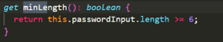
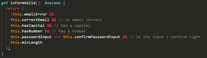
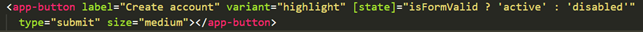

<h2>Liiketoiminta ja markkinointi</h2>

Projektin aikana opin soveltamaan liiketoiminnan ja markkinoinnin perusteita käytännössä. Aloitin tekemällä Business Model Canvasin (BMC) ja Value Proposition Canvasin (VPC), määrittäen avainresurssit, avaintoiminnot, jakelukanavat ja asiakassuhteet palvelumme näkökulmasta.

Opin ymmärtämään kohderyhmien merkityksen palvelumme kannalta: Overall markets (kaikki pelaajat), Potential markets (kilpailulliset PC-pelaajat) ja Target markets (pelaajat, jotka hakivat peliseuraa taitotason, oppimisen tai yhteisön kautta). Näitä segmenttejä määritellessä ja miettiessä hahmotin paremmin, miten palvelu voisi palvella erilaisia käyttäjiä ja heidän tarpeitaan.

Suunnittelin Figmassa ”kutsu kaveri” -sähköpostin simuloidun viraalikampanjan ja uutiskirjemallin, joilla harjoittelin viestinnän ja brändin rakentamista. Vaikka materiaaleja ei vielä julkaistu, harjoitus auttoi ymmärtämään, miten käyttäjäkokemusta voidaan tukea markkinoinnin keinoin.

Lisäksi pohdin palvelun turvallisuutta ja käyttäytymisen mittaamista sovelluksessa (esim. toksisuusmittari), sekä tietosuojaa. Opin, että käyttäjien raportoinnit ja moderointi tulee toteuttaa läpinäkyvästi ja neutraalisti, jotta yksilöitä ei lokeroida, vaan mittari keskittyy nimenomaan käytökseen. 

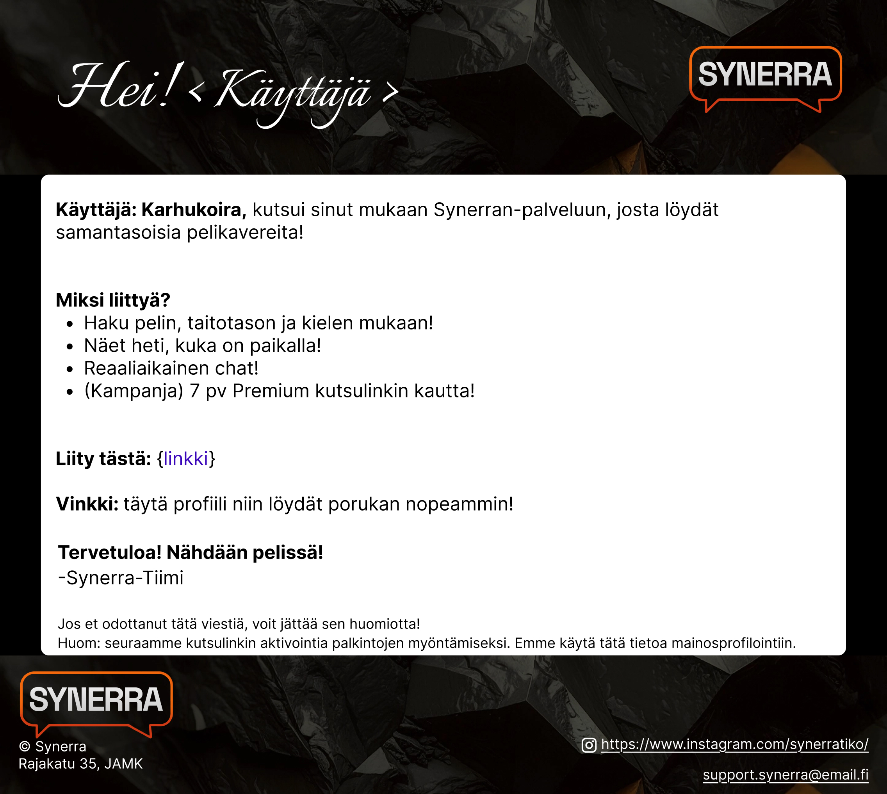
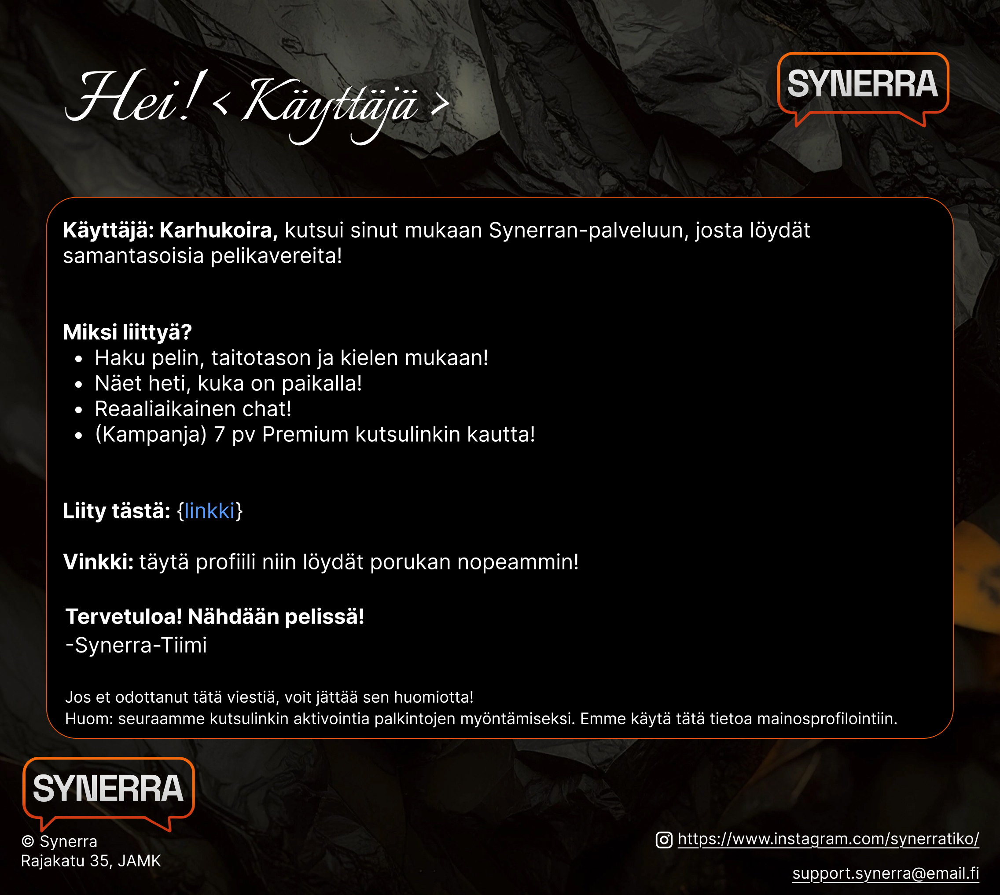

<h2>Reflektio, ja oppimisen yhteenveto</h2>

Opintojakson alussa minulla oli perustaso UI/UX-suunnittelussa, graafisen sisällön tuotanto oli hieman alle perustason ja liiketoiminnan asiat hallinnassa vain alkeet. Projektin aikana suurin oppini oli siirtyminen pelkästä visuaalisesta suunnittelusta rakenteelliseen ja komponenttipohjaiseen ajatteluun.

Opintojakson edetessä opin hyödyntämään Auto Layoutia Figma-työkalussa, suunnittelemaan skaalautuvia ja komponenttipohjaisia käyttöliittymiä sekä siirtämään suunnitelmia sujuvasti frontend-toteutukseen Angularissa (vieläkin oppimista). Samalla kehitin tiimityö-, projektinhallinta- ja liiketoimintaosaamistani käytännössä.

Projektin aikana huomasin, että käyttöliittymän jakaminen loogisiin komponentteihin ei ainoastaan helpota visuaalista suunnittelua, vaan tukee myös frontend-toteutuksen muokattavuutta ja sovelluksen laatua. Kaikkia suunniteltuja ominaisuuksia ei toteutettu, mutta niiden mallintaminen opetti "priorisoimaan" päätoimintoja ja hahmottamaan mahdollisia lisäpalveluita tulevaa kehitystä tai esim. rahoittajille esitettäväksi.

Seuraavana kehitysaskeleena haluaisin panostaa markkinointimateriaaleihin ja niiden visuaaliseen laatuun osana omaa ammatillista kehittymistäni.

<h3>Toteutumattomat ideat</h3>

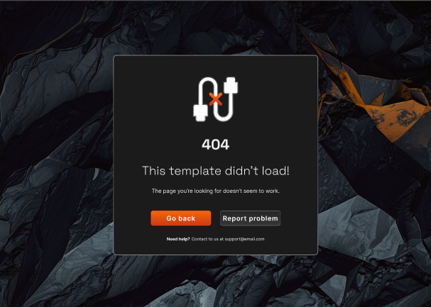

<strong>Kuva: 404 error -sivun Figma-mockup</strong>

Suunnittelin 404 error -sivun osana käyttökokemusta, vaikka sitä ei toteutettu lopulliseen sovellukseen. Virhetilanteet ovat osa käyttäjäpolkua, mutta toteutus jätettiin pois aikataulusyistä.

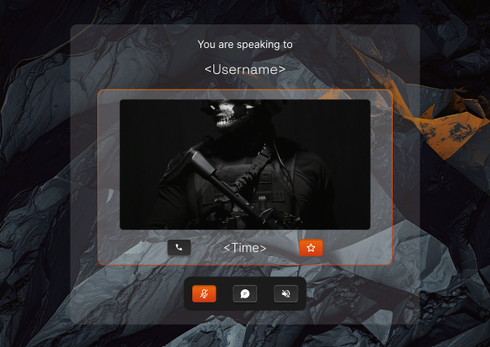
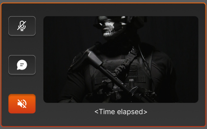

<strong>Kuva: Voice chat -toiminnallisuuden konseptimockup. Pienempi kuva näyttää yksittäisen “kortin”, joka hoveroituisi dashboardilla puhelun aikana.</strong>

Mallinsin voice chat -toiminnallisuuden Figmaan. Vaikka sitä toimintoa ei toteutettu, sen mallintaminen auttoi miettimään, miten palvelua voisi laajentaa tulevaisuudessa.

